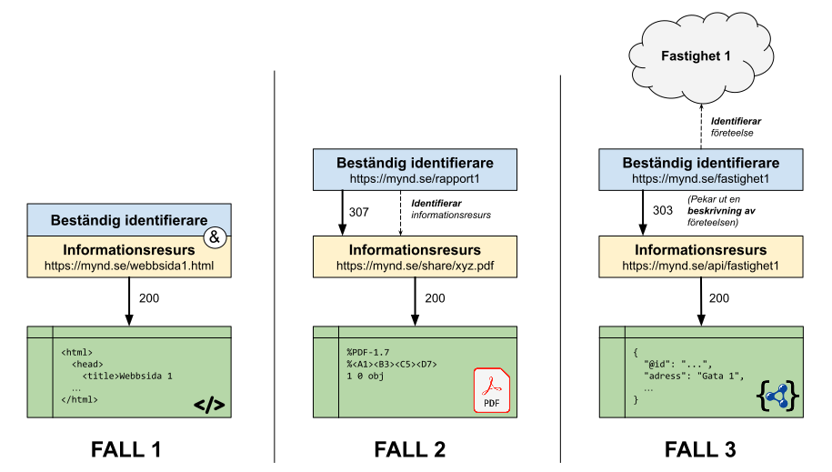

# Profil för Beständiga Identifierare

Hantering av beständiga identifierare kan ske på många sätt. Denna profil motsvarar en syn på beständiga identifierare som ligger i linje med [webbens arkitektur](https://www.w3.org/TR/webarch/). I praktiken innebär det att man förlitar sig på URI:er, DNS och HTTP protokollets olika headrar.

Denna specifikation är en profil, med det menas att vi i huvudsak förelår en speciell använding  / mönster av något existerande snarare än att introducera något nytt. Att följa profilen innebär att man beaktat alla de SKALL/BÖR/KAN regler som specificerats, mer specifikt:

>**SKALL** - Dessa regler måste följas, annars har man inte följt profilen. 
>**BÖR** - Dessa regler är starkt rekommenderade, om man inte följer dem bör man ha en stark gärna dokumenterad anledning. 
**KAN** - Dessa regler är valfria, om man har ett behov som matchar regelns syfte bör man följa regeln istället för att hitta på en egen lösning.

## Kort introduktion
För att fånga in allt det som behöver identifieras använder vi ordet *ting*. Ting kan vara fastigheter, personer, begrepp, digitala dokument osv. Vi särskiljer mellan _informationsresurser_ som är digitala och _företeelser_ som inte är digitala. Se [begreppslistan](docs/begreppslista.md) för mer information om den vokabulär som används.

Som beständiga identifierare för ting används webbadresser, dvs URL:er med scheman HTTP eller HTTPS. Uppslagning av en beständig identifierare via HTTP protokollet ger information i form av en statuskod och stödjande http-headrar. Ofta får man också en digital representation av tinget eller dess beskrivning.

I illustrationen nedan introduceras tre vanliga fall för hur beständiga identifierare används.

**Fall 1** - man använder webbadresser som beständiga identifierare direkt, webbadresser motsvarar ofta webbsidor men kan även peka på pdf:er eller ting som utrycks i olika dataformat.

**Fall 2** - man introducerar en separat beständig identifierare, t.ex. för att undvika att exponera adresser till specifika system / lagringslösningar.

**Fall 3** - man introducerar en beständig identifierare för att kunna tala om företeelser som inte är digitala, på samma gång uppnår man ett oberoende till tekniska system som API:er.

Det mesta i fall 1 motsvarar normen för hur man länkar till resurser på internet redan idag, men reglerna i profilen kan ändå vara en nyttig påminnelse om god sed. Störst fokus i profilen ligger i att beskriva när och hur man ska använda sig av fall 2 och fall 3. För en djupare genomgång av fall 2 och fall 3, läs vägledande mönster för uppslagning av [informationsresurser](docs/uppslagning_informationsresurser.md) och [företeelser](docs/uppslagning_foreteelser.md).

## Profilen består av följande delar
Profilen innefattar ett antal dokument, från formella regler till rekommendationer och användningsfall. Nedan listas dokumenten i föreslagen läsordning:

1. [Bakgrund / behovsbild](docs/bakgrund.md)
2. [Regler beständiga identifierare och uppslagning](docs/regler.md) ⇐ **den formella specifikationen**
3. [Vägledande mönster - uppslagning informationsresurser](docs/uppslagning_informationsresurser.md)
4. [Vägledande mönster - uppslagning företeelser](docs/uppslagning_foreteelser.md)
5. [Definitioner / begreppslista](docs/begreppslista.md)
6. [Rekommendationer / praxis](docs/rekommendationer.md)
7. [Användningsfall](docs/anvandningsfall.md)
8. [Användning i API:er](docs/api.md)
9. [Konfiguration av webbservrar](docs/tekniker.md)
10. [Referenser](docs/referenser.md)

## Målgrupp och behov

Profilen är i huvudsak riktad till de som bygger system inom offentlig förvaltning som görs synliga på webben. Det gäller både för tillgängliggörande av information via sidor / filer som via API:er. Särskilt viktig är profilen för de som bygger system som ska samverka med andra system / aktörer.

Det finns i huvudsak tre fördelar med att använda beständiga identifierare för olika ting:

1. Konsumenter vill kunna referera till ting på ett hållbart sätt.
2. Producenter vill kunna samordna information om ting mellan aktörer.
3. Maskiner kan instrueras att kommunicera om ting på ett väldefinierat och automatiserat sätt.

## Avgränsningar
Med beständiga identifierare avser vi identifierare som är globalt unika och har en välkänd uppslagningsprocess. Identifierare som enbart är unika inom ett visst verksamhetssystem eller kräver domänspecifik kunskap för att slå upp är inte fokus i denna specifikation.

## Arbetsprocess
Profilen har tagits fram som en förvaltningsgemensam specifikation för beständiga identifierare. Arbetet sker inom byggblock metadata som leds av [Myndigheten för digital förvaltning (DIGG)](https://www.digg.se).

Se [separat dokument](process/index.md) för mer information om möten, referensgrupp osv.

## Hur man ger återkoppling

- Skapa nya ärenden
- Kommentera på existerande
- Skapa pull-requests för konkreta ändringar
- Du kan även mejla till [info@digg.se](mailto:info@digg.se)

