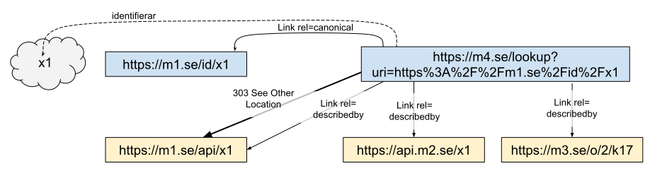

# Användarfall uppslagning av företeelser

Fall 1-5 beskriver olika situationer som kan uppkomma när man har en enskild beständig identifierare för en företeelse. Fall 6-9 berättar om situationer som kan uppkomma när man har flera beständiga identifierare för samma företeelse.   

## Fall 1 - Enkel uppslagning av företeelse
I många fall kan identifieraren till beskrivningen vara snarlik identifieraren till företeelsen. I dessa fall kan man oftast lägga in en regel i sin webbserver för att skapa en redirect till rätt identifierare. 


```  HTTP-nolint
GET /id/x1 HTTP/1.1
Host m1.se
----
HTTP/1.1 303 See Other
Location: /api/x1
Link: </api/x1>; rel="describedby" 
```
Redirecten ovan pekar på en beskrivning som med fördel förstås utifrån dess format. Representationens format utläses i headern ```content type```, eventuellt i kombination med profil information i headern ```content-profile``` (se UM-4 och UM-5). Vi tar här ett exempel med RDF uttryckt som JSON-LD, i det uttrycket ser vi identifieraren i klartext vilket gör att det inte går att missförstå vilken företeelse som beskrivs. (Det som står i ```@context``` är ett sätt att beskriva hur man ska tolka de olika attributen, i detta fall beskrivs bara attributet ```namn```, denna brukar oftast läggas utanför och länkas till).

```  HTTP-nolint
GET /api/x1 HTTP/1.1
Host m1.se
----
HTTP/1.1 200 OK
Content-type: application/ld+json

{
  "@context": {
    "namn": "http://purl.org/dc/title"
  },
  "@id": "https://m1.se/id/x1",
  "namn": "En röd boll",
  ...
}
```

## Fall 2 - Komplicerad uppslagning av företeelse
Ibland behövs en mer komplicerad mekanism för att översätta identifieraren för företeelse till en identifierare för en beskrivning. Dvs. en enkel regel i en webbserver räcker inte, istället krävs då att man skriver kod som slår upp i en databas eller liknande. 

<image src="pics/HTTP_Lookup_pattern_2.svg" width="520px"/>

```  HTTP-nolint
GET /id/x1 HTTP/1.1
Host: m1.se
----
HTTP/1.1 303 See Other
Location: /api/k25
Link: </api/k25>; rel="describedby"
```

## Fall 3 - Få kännedom om andras beskrivningar
Om det finns flera beskrivningar utöver den kanoniska kan man peka ut även dessa via link headern med describedby relationen.


```  HTTP-nolint
GET /id/x1 HTTP/1.1
Host: m1.se
----
HTTP/1.1 303 See Other
Location: /api/x1
Link:
   </api/x1>; rel="describedby", 
   <https://api.m2.se/x1>; rel="describedby",
   <https://m3.se/o/2/k17>; rel="describedby"
```

Notera att när man slår upp beskrivningarna kommer samma identifierare användas, dvs ```https://m1.se/id/x1``` används i svaren som kommer från m1.se, m2.se och m3.se. Dock kommer själva påståenden i beskrivningarna att skilja sig åt eftersom de motsvarar olika aktörers syn på samma företeelse.

T.ex. aktören bakom m1.se hävdar att det är en röd boll:

```  HTTP-nolint
GET /api/x1 HTTP/1.1
Host m1.se
----
HTTP/1.1 200 OK
Content-type: application/ld+json

{
  "@id": "https://m1.se/id/x1",
  "http://purl.org/dc/title": "En röd boll",
}
```

medans aktören bakom m3 hävdar att bollen är grön:

```  HTTP-nolint
GET /o/2/k17 HTTP/1.1
Host m3.se
----
HTTP/1.1 200 OK
Content-type: application/ld+json

{
  "@id": "https://m1.se/id/x1",
  "http://purl.org/dc/title": "En grön boll",
}
```


## Fall 4 - Hänvisa till uppslagstjänst för andras beskrivningar
Om man inte har koll på vilka ytterligare beskrivningar som finns kan man hänvisa till en extern uppslagstjänst.


```  HTTP-nolint
GET /id/x1
Host: m1.se
----
HTTP/1.1 303 See Other
Location: /api/x1
Link:
  </api/x1>; rel="describedby",
  <https://m4.se/lookup?uri=https%3A%2F%2Fm1.se%2Fid%2Fx1>; rel="alternate"
```

## Fall 5 - Uppslagningstjänst
Uppslagstjänsten fungerar nästan på samma sätt som en vanlig uppslagning, den enda skillnaden är att man pekar tillbaka på den ursprungliga identifieraren via link headern med relationen canonical.



```  HTTP-nolint
GET /lookup?uri=https%3A%2F%2Fm1.se%2Fid%2Fx1 HTTP/1.1
Host: m4.se
----
HTTP/1.1 303 See Other
Location: https://m1.se/api/x1
Link:
  <https://m1.se/id/x1>; rel="canonical",
  <https://m1.se/api/x1>; rel="describedby",
  <https://api.m2.se/x1>; rel="describedby",
  <https://m3.se/o/2/k17>; rel="describedby"
```

Om man nu kombinerar fall 4 och 5 får man en mer komplett bild om hur relationerna uttrycks:


**TODO: Hitta på en till http header som gör det möjligt att förstå att adressen till uppslagningstjänsten är just en uppslagningstjänst som särskiljer från användning av link rel=alternate i fall 7, 8 och 9.** 

## Fall 6 - Dubbla identifierare utan relationer - UNDVIK!
När en aktörer inte har kännedom eller väljer att gå sin egen väg kan det hända att en företeelse får fler än en identifierare. Utan explicita relationer mellan identifierna går det inte att utläsa att det handlar om samma företeelse.


De två identifierarna kan slås upp separat och ger olika redirects och förståss olika beskrivningar.
```  HTTP-nolint
GET /id/x1 HTTP/1.1
Host m1.se
----
HTTP/1.1 303 See Other
Location: /api/x1
Link: </api/x1>; rel="describedby"
```

```  HTTP-nolint
GET /id/k17 HTTP/1.1
Host m3.se
----
HTTP/1.1 303 See Other
Location: /o/2/k17
Link: </o/2/k17>; rel="describedby"
```

Att det är olika identifierare syns ockå i beskrivningarna. T.ex. aktören bakom m1.se hävdar som i tidigare exempel att ```https://m1.se/id/x1``` motsvarar en röd boll:

```  HTTP-nolint
GET /api/x1 HTTP/1.1
Host m1.se
----
HTTP/1.1 200 OK
Content-type: application/ld+json

{
  "@id": "https://m1.se/id/x1",
  "http://purl.org/dc/title": "En röd boll",
}
```

detta är helt särskilt från att aktören bakom m3 påstår att identifieraren ```https://m3.se/id/k17``` motsvarar en grön boll:

```  HTTP-nolint
GET /o/2/k17 HTTP/1.1
Host m3.se
----
HTTP/1.1 200 OK
Content-type: application/ld+json

{
  "@id": "https://m3.se/id/k17",
  "http://purl.org/dc/title": "En grön boll",
}
```


## Fall 7 - Dubbla identifierare med relationer utan överenskommelse - UNDVIK!
Om två aktörer är medvetna om varandra, men av olika skäl har valt att skapa en egen identifierare för samma företeelse och inte kan komma överens om vems identifierare som är kanonisk får man en förvirrad situation. Även denna situation bör undvikas, men situationen är iallafall bättre än fall 6 eftersom man här iallafall ger informationskonsumenter en möjlighet att förstå att det handlar om samma företeelse. Då detta inte är ett tekniskt problem är det möjligt att tiden utvisar vilken identifierare som används mest och då bör vara den kanoniska vilket förhoppningsvis då kan accepteras av den ena aktören.


Precis som i fallet med uppslagningstjänst används här Link alternate för att peka ut den andra identifieraren.

```  HTTP-nolint
GET /id/k17 HTTP/1.1
Host m3.se
----
HTTP/1.1 303 See Other
Location: /o/2/k17
Link: </o/2/k17>; rel="describedby",
      <https://m1.se/id/x1>; rel="alternate"
```

Utöver link headrar är det också möjligt att i beskrivningen uttrycka relationer mellan idenfifierarna.

```  HTTP-nolint
GET /o/2/k17 HTTP/1.1
Host m3.se
----
HTTP/1.1 200 OK
Content-type: application/ld+json

{
  "@id": "https://m3.se/id/k17",
  "http://purl.org/dc/title": "En grön boll",
  "http://www.w3.org/1999/xhtml/vocab#alternate": {
    "@id": "https://m1.se/id/x1"
  }
}
```

## Fall 8 - Dubbla identifierare med relationer och överenskommelse

I det här fallet är de två aktörerna ense om att ```https://m1.se/id/x1``` är den officiella identifieraren som ska användas i beskrivningarna. Men trots det vill aktören bakom m3.se ha en egen identifierare som gör en redirect till sin beskrivning snarare än till beskrivning som aktören bakom m1.se tillhandahåller.


I bilden ovan är det enbart Link headerns som säger canonical i ena riktningen som är annorlunda än fall 7:


```  HTTP-nolint
GET /id/k17 HTTP/1.1
Host m3.se
----
HTTP/1.1 303 See Other
Location: /o/2/k17
Link: </o/2/k17>; rel="describedby",
      <https://m1.se/id/x1>; rel="canonical"
```

I beskrivningen är det mer som skiljer då man bytt plats på identifierarna:

```  HTTP-nolint
GET /o/2/k17 HTTP/1.1
Host m3.se
----
HTTP/1.1 200 OK
Content-type: application/ld+json

{
  "@id": "https://m1.se/id/x1",
  "http://purl.org/dc/title": "En grön boll",
  "http://www.w3.org/1999/xhtml/vocab#alternate": {
    "@id": "https://m3.se/id/k17"
  }
}
```

## Fall 9 - Dubbla identifierare med uppslagningstjänst

Slutligen är det möjligt att det finns dubbla identifierare där man kommit överens och samtidigt att man använder en uppslagningstjänst.


Notera att fall påminner starkt om fall 5, den enda skillnaden är att man har ytterligare en identifierare som när den slås upp pekar på en annan beskrivning än den beskrivning man får om man använder den kanoniska identifieraren eller uppslagningstjänsten.

