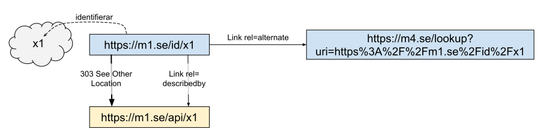

# Användarfall uppslagning av företeelser

Nedan kallar vi beständiga identifierare i form av URL:er för adresser då det är enklare att läsa.

## Fall 1 - Enkel uppslagning av företeelse
I många fall kan adressen till beskrivningen vara snarlik adressen till företeelsen. I dessa fall kan man oftast lägga in en regel i sin webbserver för att skapa en redirect till rätt adress. 


```  HTTP-nolint
GET /id/x1 HTTP/1.1
Host m1.se
----
HTTP/1.1 303 See Other
Location: /api/x1
```

## Fall 2 - Komplicerad uppslagning av företeelse
Ibland behövs en mer komplicerad mekanism för att översätta adressen för företeelse till en adress för en beskrivning. Dvs. en enkel regel i en webbserver räcker inte, istället krävs då att man skriver kod som slår upp i en databas eller liknande. 

<image src="pics/HTTP_Lookup_pattern_2.svg" width="520px"/>

```  HTTP-nolint
GET /id/x1 HTTP/1.1
Host: m1.se
----
HTTP/1.1 303 See Other
Location: /api/k25
```

## Fall 3 - Få kännedom om andras beskrivningar
Om det finns flera beskrivningar utöver den kanoniska kan man peka ut även dessa via link headern med describedby relationen.


```  HTTP-nolint
GET /id/x1 HTTP/1.1
Host: m1.se
----
HTTP/1.1 303 See Other
Location: /api/x1
Link:
   </api/x1>; rel="describedby", 
   <https://api.m2.se/x1>; rel="describedby",
   <https://m3.se/o/2/k17>; rel="describedby"
```

## Fall 4 - Hänvisa till uppslagstjänst för andras beskrivningar
Om man inte har koll på vilka ytterligare beskrivningar som finns kan man hänvisa till en extern uppslagstjänst.



```  HTTP-nolint
GET /id/x1
Host: m1.se
----
HTTP/1.1 303 See Other
Location: /api/x1
Link:
  </api/x1>; rel="describedby",
  <https://m4.se/lookup?uri=https%3A%2F%2Fm1.se%2Fid%2Fx1>; rel="alternate"
```

## Fall 5 - Uppslagningstjänst
Uppslagstjänsten fungerar nästan på samma sätt som en vanlig uppslagning, den enda skillnaden är att man pekar tillbaka på den ursprungliga beständiga identifieraren via link headern med relationen canonical.


```  HTTP-nolint
GET /lookup?uri=https%3A%2F%2Fm1.se%2Fid%2Fx1 HTTP/1.1
Host: m4.se
----
HTTP/1.1 303 See Other
Location: https://m1.se/api/x1
Link:
  <https://m1.se/id/x1>; rel="canonical",
  <https://m1.se/api/x1>; rel="describedby",
  <https://api.m2.se/x1>; rel="describedby",
  <https://m3.se/o/2/k17>; rel="describedby"
```

Om man nu kombinerar fall 4 och 5 får man en mer komplett bild om hur relationerna uttrycks:

