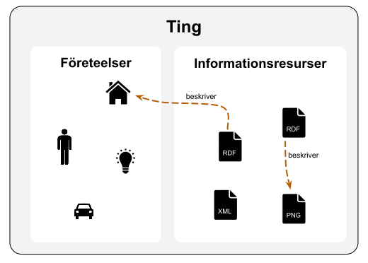
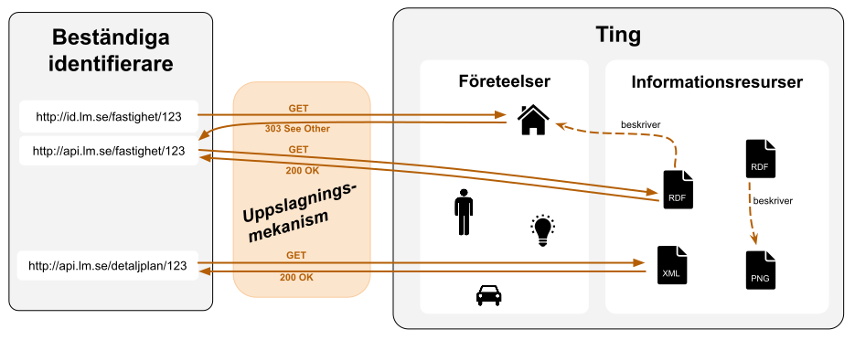
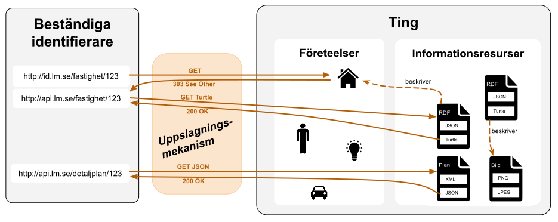

# Bakgrund / behovsbild

Genom historien har människan satt namn på saker. Dessa namn var och är fortfarande centrala i vår dagliga kommunikation. Namngivningen gör det möjligt att beskriva såväl vår omvärld som det som inte låter sig fångas lika lätt, t.ex. idéer, tankar, historiska skeenden, fiktiva karaktärer osv.

Carl von Linné skapade namn som var mer universella och beständiga genom att använda det latinska språket. Det Linné gav namn till är arter som i sig omfattar tusentals eller miljontals individer. Att kunna särskilja dessa individer kräver ett annat angreppssätt. Kyrkoböcker och mantalsskrivning identifierade personer via en kombination av namn, födelsedatum och plats. I vårt moderna samhälle fungerar detta platsbundna angreppssätt mindre bra varför Sverige i mitten av 1900-talet införde personnummer som en identifierare som står mer självständigt. En tydlig skillnad i användningen av namn och identifierare är att identifierare sällan behöver användas i vårt talspråk. Ett liknande exempel är fastighetsbetechningar som blivit mer reglerat under 1900 talets första hälft och idag består av en sträng tecken som innefattar kommunnamn, traktnamn, blocknummer och enhetsnummer.

## Identifierare i modern tid
I samband med digitaliseringen har behovet av att identifiera saker ökat. Idag finns behov att kunna referera till dokument, ärenden, händelser, bilar, bolag, platser osv. Samtidigt har den digitala hanteringen ändrat på förutsättningarna i hur identifierare behöver se ut och användas. Det är sällan vi behöver memorera och använda identifierarna i vårt talspråk. En maskinell bearbetning innebär å andra sidan krav på en större exakthet då människor inte är inblandade och kan ta hänsyn till sammanhanget för att förstå vad som avses med en identifierare.

För att minimera risken för krockar och behovet av specialutvecklad programvara är det eftersträvansvärt att använda identifierare som fungerar på samma sätt oberoende av vilken domän vi är inom. Detta gör också att man minskar risken för att identifierarna krockar.  

## Vad vill vi kunna identifiera
Vi kommer även fortsättningsvis behöva referera till fysiska saker i form av fastigheter, platser, bilar, människor och djur. Men vi har även behov av att tala om dessa saker efter att de inte längre finns kvar, människor dör, fastigheter delas upp eller slås samman, bilar skrotas osv. Vidare kan vi behöva tala om saker i världen som är mindre påtagliga, det kan vara ett politiskt val, en konsert, ett företag eller en art i Linnés systematik. Till detta kommer våra behov att kunna referera till den digitala information vi vant oss vid att ha åtkomst till via internet, det kan vara webbsidor, bilder, dokument, kalenderhändelser.

Med ett gemensamt ord väljer vi att kalla allt vi vill kunna identifiera för **ting**. Vi separerar samtidigt tingen i **informationsresurser** som är digitala och går att förmedla i sin helhet och **företeelser** som är allt i den fysiska eller sinnesvärlden som vi endast kan få ofullständiga **beskrivningar** av. 

En beskrivning är en informationsresurs som endast innehåller påståenden om ett eller flera andra ting via deras beständiga identifierare. En beskrivning kan alltså uttrycka påståenden om en företeelse, en informationsresurs eller en blandning av båda.

## Vilka krav ställer vi på identifierare

Med en identifierare menas en sträng tecken som refererar till ett ting. För att identifieraren ska vara beständig menas att den på ett tydligt och välkänt sätt refererar till samma ting över en längre tid utan att behöva ändras. Identifierare för ting kan skapas av aktörer utan att samma aktörer har något formellt ägande / förvaltningsansvar.

I samband med att webben växte fram började man tala om URI:er, en förkortning för Unified Resource Identifier, vilket är ett sätt att identifiera resurser av olika slag. Man talar också om URL:er vilket står för Unified Resource Locator. Till skillnad från URI:er specificerar URL:er ett protokoll som säger hur man slår upp (lokalisera) identifieraren.

I den här rekommendationen föreslås att använda URL:er med schemat `http` eller `https` för beständiga identifierare. Dvs det vi i vardagligt tal kallar för webbadresser. Observera att webbadresser som `http://example.com/ett_ting` kan användas för att peka ut såväl informationsresurser som företeelser.

En viktig egenskap som vi får på köpet när vi använder URL:er med http eller https schemat som identifierare är att första delen utgörs av ett domännamn. Alla domännamn förvaltas av någon, ofta en organisation vilket innebär att det finns en mekanism för att förvalta ansvaret kring hanteringen av webbadresser mellan organisationer. Domännamn slås upp via DNS (Domain Name System) vilket är ett system för att på ett säkert och distribuerat sätt slå upp vilken dator som ska svara på frågor för alla webbadresser inom den domänen.

## Hur når vi fram till det som identifieras
För att ta sig från en identifierare för ett ting till en digital representation behövs en uppslagningsmekanism. Vid uppslagning av identifierare för informationsresurser kan en representation levereras enkelt. Men uppslagning av företeelser är mer problematisk, särskilt då företeelser som personer, hus, idéer osv. inte är digitala. I dessa fall måste uppslagningsmekanismen svara med att de inte har en egen digital representation. Vad man kan göra dock är att peka ut en annan identifierare som när den slås upp leder till en beskrivning av företeelsen.

## En informationsresurs kan finnas i flera olika representationer
Bilden ovan är lite förenklad då en viss informationsresurs kan finnas tillgänglig i flera olika representationer (format). Vilken representation man får tillbaka beror på vad den som frågar ber om och vad som servern kan leverera.

## Vad händer om det finns flera beskrivningar av en företeelse

För uppslagning av ting som är objekt är uppslagningen unik eftersom objektets representationer är att betrakta som uttömmande. Till exempel, ett dokument i form av en pdf eller ett Word-dokument med samma innehåll är likvärdiga, vilken representation som levereras beror endast på klientens preferenser. Detta innebär att för objekt kan uppslagningen alltid genomföras på ett unikt sätt i den mening att det är tydligt vilket innehåll och vilken representation som ska returneras.

Det motsatta gäller för uppslagning av ting som är företeelser. Eftersom företeelser inte är digitala kommer vi aldrig kunna tillhandahålla uttömmande beskrivningar av dem. Det betyder att vilken beskrivning som levereras av uppslagningsmekanismen kommer bestämmas av aktören som tillhandahållit identifieraren, vilket inte är en unik uppslagning. En annan aktör kan ha tillhandahållit en minst lika bra beskrivning för företeelsen med tyngdpunkt på andra aspekter (utifrån andra informationsbehov).

**Observation 1**, det är tillåtet för uppslagningsmekanismen att i sitt svar indikera alternativa beskrivningar (utöver den huvudsakliga) som den känner till för en företeelse.

**Observation 2**, även informationsresurser som har digitala representationer kan ha associerade beskrivningar (t.ex. metadata om ett dokument som förvaltas separat). Om så är fallet kan samma frivilliga mekanism för att indikera alternativa beskrivningar användas.
