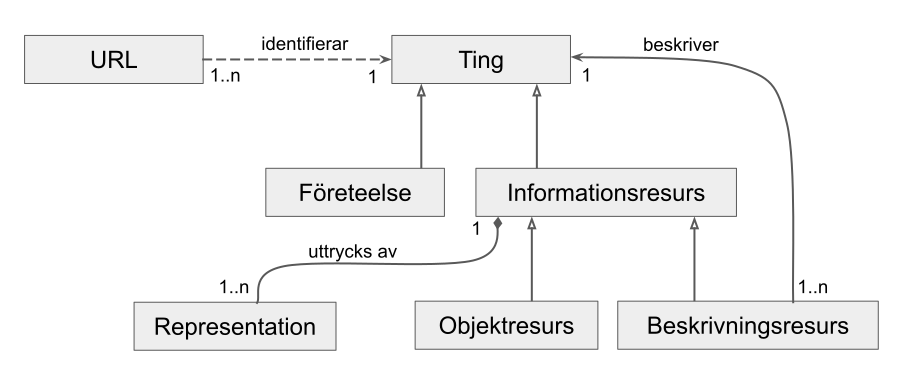

# Definitioner / begreppslista

Följande UML diagram visar hur några av de mest centrala begreppen hänger samman.

## Ting
Ett ting är något vi har ett behov att kommunicera om. När vi talar om tinget benämner vi det oftast med ett namn eller en identifierare för att bättre kunna koordinera vår kommunikation över tid. När vi talar om tinget uttrycker vi påståenden, sanna eller falska, om antinget tinget själv eller relationer till andra ting. 

Exempel på ting inkluderar:

* **Materialla objekt** i den fysiska världen som bilar eller fastigheter.
* **Levande ting** som personer eller djur
* **Historiska händelser** som första världskriget eller månlandningen
* **Påhittade ting** som Kalle Anka eller Gandalf
* **Abstrakta ting** som Newtons andra lag eller en perfekt cirkel
* **Begrepp i en terminologi** som arten Homo Sapiens i Linnés systematik eller ämnet cellbiologi i de Svenska högskoleämnena
* **Digitala ting** som digitala bilder eller dokument
* **Beskrivningar** (t.ex. RDF grafer) av andra ting

## Resurs
En synonym till ting.

## Företeelse
Många ting är inte digitala, t.ex. se exempel 1-6 ovan som alla har gemensamt att det inte går att tillhandahålla en digital representation som kan påstås vara uttömmande. Vi kallar alla dessa icke-digitala ting för *företeelser*.  

## Informationsresurs
En del ting består endast av information och kan följaktligen representeras digitalt, vi kallar dessa ting för informationsresurser. Exempel ovan är bilder, dokument eller beskrivningar.

## Beskrivningsresurs
En beskrivningsresurs är en informationsresurs som endast innehåller påståenden om ett eller flera andra ting via deras beständiga identifierare. En beskrivningsresurs kan uttrycka påståenden om en företeelse, en informationsresurs eller en blandning av båda.

## Objektresurs
En objektresurs är en informationsresurs som innehåller information som kan uttryckas utan att referera till andra ting. Exempel på objekt är bilder, dokument, mätserier, osv.

## Representation
I många fall kan en informationsresurs uttryckas på många olika sätt. En vanlig situation är att man representera en bild som SVG eller PNG, ett dokument som PDF eller DOCX osv. Det konkreta digitala uttrycket av en informationsresurs kallas en representation. 

## Format
Ett format är en syntax som används för att uttrycka en representation av en informationsresurs. 

## Identifierare
Med en identifierare menas en sträng tecken som refererar till ett ting.  Identifierare för ting kan skapas av aktörer utan att samma aktörer har något formellt ägande / förvaltningsansvar.

## Beständiga identifierare
För att en identifierare ska vara beständig menas att den på ett tydligt och välkänt sätt refererar till samma ting över en längre tid utan att behöva ändras.

## Uppslagning
Att slå upp en identifierare innebär att man tar sig från identifieraren till någon information som antingen innefattar eller beskriver tinget som identifieras.

Förr i tiden fanns i bibliotek ofta kartotek där man från en titel på en bok (eller författarens namn) kunde ta fram mer information utan att gå ut och leta i hyllorna. Idag sker sådan uppslagning med hjälp av datorsystem. Att själv slå upp boken genom att gå ut i hyllorna och leta reda på den givet kombinationen av författarens namn och bokens titel är en direkt form av uppslagning.

## Uppslagningsmekanism
Idag är uppslagning oftast en maskinell process. Den mest välkända mekanismen är kombinationen av DNS (Domain Name System) och HTTP (HyperText Transfer Protocol) som båda är centrala för hur webben fungerar idag. Uppslagninsmekanismen för en URL sker i två steg. I första steget slår man upp domännamnet till en IP-adress som motsvarar en server. I andra steget kontaktar man servern på den IP adressen och ber om den mer specifika resurs som anges via URL:ens path som kommer efter domännamnet.

