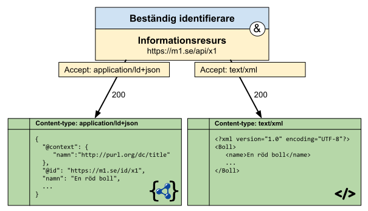

# Konfiguration av webbservrar

## Redirects
Vi undersöker hur vi kan konfigurera webbservrar för redirects. Vi fokuserar på att lösa mönster 4 från uppslagning av företeelser.


Vi vill konfigurera Apache och IIS för att stödja följande interaktion:

```  HTTP-nolint
GET /id/x1
Host: m1.se
----
HTTP/1.1 303 See Other
Location: /api/x1
Link:
  </api/x1>; rel="describedby",
  <https://m4.se/lookup?uri=https%3A%2F%2Fm1.se%2Fid%2Fx1>; rel="alternate"
```

> **Obs.** Lösningarna nedan är för enklare uppslagningar som kan lösas genom omskrivningar av pathen, inte mer komplicerade fall, (se t.ex. mönster 2). Undantaget är när vi endast har ett fåtal id:n som inte förändras ofta, i en sådan situation kan man hårdkoda uppslagning av varje id i konfigurationen. I alla andra situationer krävs en egen implementation som agerar webbserver. En sådan implementation fungerar oftast genom att den slår mot en databas som innehåller en översättning mellan id. Oftast servas sådana implementationer bakom en mer standardiserad webbserver som apache eller IIS som då agerar som "reverse proxy", ofta för att garantera skalbarhet, säkerhet eller bara för att förenkla driftsmiljön på en server.

### Konfigurera Apache
Apache tillhandahåller ett rikt konfigurationsspråk, så det som beskrivs nedan är förslag på tillvägagångssätt. Vi använder oss av konfigurationsblocket `Location` för att begränsa oss till endast adresser under `/id/`. Vi använder sen `RedirectMatch` direktivet för att genomföra 303 redirect och därefter sätter vi två link headrar via `Header` direktivet. Notera att vi behöver escapa pathen som finns i `REQUEST_URI` variabeln via `escape` funktionen.

```  HTTP-nolint
<Location "/id">
  RedirectMatch 303 "^/id/(.+)" "/api/$1"
  Header Set Link "<%{REQUEST_URI}>; rel=\"describedby\", <https://m4.se/lookup?uri=https%3A%2F%2Fm1.se%{escape:REQUEST_URI}; rel=\"alternate\""
</Location>
```

Läs mer om [konfigurationsblock](https://httpd.apache.org/docs/2.4/sections.html#file-and-web), [redirect](https://httpd.apache.org/docs/2.4/mod/mod_alias.html#redirectmatch), [headrar](https://httpd.apache.org/docs/2.4/mod/mod_headers.html#header) samt [variabler, uttryck och funktioner](https://httpd.apache.org/docs/2.4/expr.html). 


Ett alternativ är att använda mod_rewrite, detta kan vara användbart om du behöver kombinera med mer komplicerade villkor, t.ex. för content negotiation (se sektion om detta längre ner).
```  HTTP-nolint
RewriteEngine on
RewriteRule "^/id/(.+)" "/api/$1" [R=303]

<Location "/id">
  Header Set Link "<%{REQUEST_URI}>; rel=\"describedby\", <https://m4.se/lookup?uri=https%3A%2F%2Fm1.se%{escape:REQUEST_URI}>; rel=\"alternate\""
</Location>
```
Läs mer på den [officiella dokumentationen](https://httpd.apache.org/docs/2.4/rewrite/remapping.html) av mod_rewrite.

## Konfigurera IIS

För att åstadkomma redirects i IIS behöver man använda [URL Rewrite modulen](https://www.iis.net/downloads/microsoft/url-rewrite). Du kan behöva installera modulen.

Följ instruktionerna för att [skapa en rewrite regel](https://learn.microsoft.com/en-us/iis/extensions/url-rewrite-module/creating-rewrite-rules-for-the-url-rewrite-module).

Under rubriken "Creating a redirect rule" ska du ange följande:

1. Ange ett regelnamn som passar dig.
2. Som pattern anger du: `^id/(.+)`.
3. Som action type väljer du `Redirect`.
2. Som Redirect URL anger du: `api/{R:1}`.
3. Som redirect type anger du: `See other (303)`.

Resultatet bör se ut som följer i `%SystemDrive%\inetpub\wwwroot\Web.config`:

```  HTTP-nolint
<rewrite>
  <rules>
    <rule name="__ditt_regelnamn__">
      <match url="^id/(.+)" />
      <action type="Rewrite" url="api/{R:1}" redirectType="See other"/>
    </rule>
  </rules>
</rewrite>
```

För att lägga till `link` headern behöver vi använda en [outbound rewrite rule](https://learn.microsoft.com/en-us/iis/extensions/url-rewrite-module/url-rewrite-module-20-configuration-reference#setting-response-headers). Outbound rules har stor flexibilitet och det finns ingen perfekt guide att peka på, de närmaste guiderna skriver om hur man [skriver om länkar inne i den HTML som leveras](https://learn.microsoft.com/en-us/iis/extensions/url-rewrite-module/creating-outbound-rules-for-url-rewrite-module#create-an-outbound-rewrite-rule) samt hur en [existerande Location header skrivs om](https://learn.microsoft.com/en-us/iis/extensions/url-rewrite-module/modifying-http-response-headers#creating-an-outbound-rule-to-modify-the-http-response-header). Båda exemplena involverar mycket extra komplexitet som vi inte behöver, de kan dock fungera att titta på då de innehåller en del screenshoots. Det som behöver göras är:

1. Skapa en ny `rule` genom att välja "blank rule" under "outbound rules".
2. Ge regeln ett namn.
3. Under "Matching scope":
   1. välj `Server variable`
   2. ange `RESPONSE_Link` som variabelnamn
   3. Välj `Matches the value` för "variable value"
   4. Välj `Regular expression` för "Using"
   5. Skriver in uttrycket `^$^` för "pattern".
4. Under "Condition" lägg in en rad:
   1. `{REQUEST_URI` under kolumnen "input"
   2. `Matches the pattern` under kolumnen "type"
   3. `^/id/(.*)$` under kolumnen "Pattern".
5. Under action:
   1. ställ in "Action type" till `Rewrite`
   2. ange `<{REQUEST_URI}>; rel=\"describedby\", <https://m4.se/lookup?uri={UrlEncode:https://m1.se{REQUEST_URI}}>; rel=\"alternate\"` som "value"

Efter att du sparat bör resultatet av detta att följande struktur har dykt upp i `%SystemDrive%\inetpub\wwwroot\Web.config`. 

```  HTTP-nolint
<outboundRules>
    <rule name="__ditt_regelnamn__">
        <match serverVariable="RESPONSE_Link" pattern="^$" />
        <conditions>
          <add input="{REQUEST_URI}" pattern="^/id/(.*)$" />
        </conditions>
        <action type="Rewrite" value="<{REQUEST_URI}>; rel=\"describedby\", <https://m4.se/lookup?uri={UrlEncode:https://m1.se{REQUEST_URI}}>; rel=\"alternate\"" />
    </rule>
</outboundRules>
```
## Content negotiation

Vi undersöker nu hur vi kan konfigurera webbservrar praktiskt för content negotiation. Vi fokuserar på att lösa mönster 3 från uppslagning av informationsresurser.



Det vill säga, vi vill konfigurera Apache och IIS för att stödja uppslagning av JSON-LD och XML respektive.

Anrop för att få `application/ld+json`:

```  HTTP-nolint
GET /api/x1 HTTP/1.1
Host: m1.se
Accept: application/ld+json,application/json;q=0.9
----
HTTP/1.1 200 OK
Content-type: application/ld+json
Link: </api/x1>; rel="canonical"; type="application/ld+json",
      </api/x1>; rel="alternate"; type="text/xml", 

{
  "@context": {
    "namn": "http://purl.org/dc/title"
  },
  "@id": "https://m1.se/id/x1",
  "namn": "En röd boll",
  ...
}
```

Anrop för att få `text/xml`:

```  HTTP-nolint
GET /api/x1 HTTP/1.1
Host: m1.se
Accept: text/xml;q=0.9
----
HTTP/1.1 200 OK
Content-type: text/xml
Link: </api/x1>; rel="canonical"; type="application/ld+json",
      </api/x1>; rel="alternate"; type="text/xml",

<?xml version="1.0" encoding="UTF-8"?>
<Boll>
   <name>En röd boll</name>
   ...
</Boll>
```
### Konfigurera Apache

#### Filer med olika filändelser
Om vi antar att JSON-LD och XML versionerna av resursen finns i samma katalog med olika filändelser, typiskt `.jsonld` och `.xml`. I detta scenario kan vi använda Apaches MultiType option och lägga till korrekt matchningar mellan mediatyper och filändelser.

```  HTTP-nolint
ServerName m1.se
DocumentRoot /var/www/
<Directory "/api">
  Options Multiviews
  AddType text/xml .xml
  AddType application/ld+json .jsonld
  
  Header Set Link "<%{REQUEST_URI}>; rel=\"canonical\"; type="application/ld+json", <%{REQUEST_URI}>; rel=\"alternate\"; type=\"text/xml\""
</Directory>
```

#### Slå mot ett annat system

I många fall finns inte de olika formaten sparade på disk, istället får man ut dem genom att ställa frågan vidare mot ett annat system. I detta fall agerar Apache som en reverse proxy och vi behöver förlita oss på mod_rewrite eftersom det blir mer komplicerat med villkor kring format. Nedan antar vi att det andra systemet är driftsatt på samma server och tar en parameter `format` med den mediatyp som efterfrågas.

```  HTTP-nolint
RewriteEngine on

RewriteCond %{HTTP_ACCEPT} ^application/ld+json
RewriteRule "^/api/(.+)" "http://localhost:8000/$1?format=application/ld+json" [P]

RewriteCond %{HTTP_ACCEPT} ^application/ld+json
RewriteRule "^/api/(.+)" "http://localhost:8000/$1?format=application/ld+json" [P]


<Location "/api">
Header Set Link "<%{REQUEST_URI}>; rel=\"canonical\"; type="application/ld+json", <%{REQUEST_URI}>; rel=\"alternate\"; type=\"text/xml\""
</Location>
```

Observera att tekniken ovan inte är begränsad till system som är driftsatta på samma server.

### Konfigurera IIS

Oavsett om man använder metoden med filändelser eller slår mot ett annat system behöver man använda URL rewrite modulen för att skapa link headers. Se detaljerad dokumentation högre upp för detta. Resultatet bör bli ungefär detta:

```  HTTP-nolint
<outboundRules>
    <rule name="Set Link Header">
        <match serverVariable="RESPONSE_Link" pattern="^$" />
        <conditions>
          <add input="{REQUEST_URI}" pattern="^/api/(.*)$" />
        </conditions>
        <action type="Rewrite" value="<{REQUEST_URI}>; rel=\"canonical\"; type="application/ld+json", <{REQUEST_URI}>; rel=\"alternate\"; type=\"text/xml\"" />
    </rule>
</outboundRules>
```

#### Filer med olika filändelser

Se dokumentation om hur man skapar en [översättningstabell (mimeMap)](https://learn.microsoft.com/en-us/iis/configuration/system.webserver/staticcontent/mimemap) mellan olika filändelser och mediatyper i IIS kongfiguration för statiskt innehåll.

#### Slå mot ett annat system
Läs om hur man konfigurerar [regler för reverse proxy funktionalitet i IIS](https://learn.microsoft.com/en-us/iis/extensions/url-rewrite-module/reverse-proxy-with-url-rewrite-v2-and-application-request-routing#configuring-rules-for-the-reverse-proxy).

Konfigurationen bör se ut ungefär som följer:

```  HTTP-nolint
<rewrite>
  <rules>
    <rule name="Reverse proxy för JSON-LD" stopProcessing="true">
      <match url="^api/(.*)" />
      <conditions>
        <add input="{ALL_HTTP}" pattern="HTTP_ACCEPT:application/ld\+json" />
      </conditions>
      <action type="Rewrite" url="http://localhost:8080/{R:1}?format=application/ld+json" />
    </rule>
    <rule name="Reverse proxy för JSON-LD" stopProcessing="true">
      <match url="^api/(.*)" />
      <conditions>
        <add input="{ALL_HTTP}" pattern="HTTP_ACCEPT:text/xml" />
      </conditions>
      <action type="Rewrite" url="http://localhost:8080/{R:1}?format=text/xml" />
    </rule>
  </rules>
</rewrite>
```

Observera att tekniken inte är begränsad till system som är driftsatta på samma server.