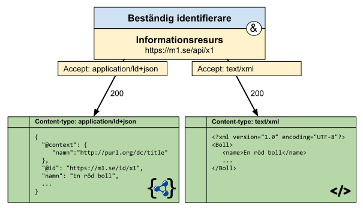

# Vägledande mönster för uppslagning av informationsresurser

## Mönster 1 - Enkel uppslagning av informationsresurs

En klient frågar efter en informationsresurs via dess beständiga identifierare. Det finns bara en representation av informationsresursen (ett format) och det levereras till klienten.


```  HTTP-nolint
GET /api/x1 HTTP/1.1
Host m1.se
----
HTTP/1.1 200 OK
Content-type: application/ld+json

{
  "@context": {
    "namn": "http://purl.org/dc/title"
  },
  "@id": "https://m1.se/id/x1",
  "namn": "En röd boll",
  ...
}
```

## Mönster 2 - Stabil adress till en informationsresurs som flyttas runt

En klient ber om en informationsresurs, över tid har informationsresursen flyttat runt mellan olika tekniska lösningar. Dess beständiga identifierare är densamma och i varje läge besvaras uppslagningen med en HTTP status kod 307 med en location header som pekar ut var informationsresursen befinner sig för närvarande.


```  HTTP-nolint
GET /rapport1 HTTP/1.1
Host m1.se
----
HTTP/1.1 307 Temporary redirect
Location: /share/rapport1.0.1.pdf
```

Detta leder till att klienten kan göra en ytterligare uppslagning:

```  HTTP-nolint
GET /share/rapport1.0.1.pdf HTTP/1.1
Host m1.se
----
HTTP/1.1 200 OK
Content-type: application/pdf

%PDF-1.7
%<A1><B3><C5><D7>
1 0 obj
...
```

## Mönster 3 - Content negotiation

En klient frågar efter en informationsresurs men informerar att den föredrar vissa representationer (format) före andra. Servern har flera olika representationer och svarar med den representation som bäst motsvarar det klienten ber om.
Alla de olika möjliga representationerna BÖR indikeras via link headrar med format angivelse.



För att öka läsbarheten har vi utelämnat den information om alternativa format vi får i svaret och även att vi accepterar andra format som fallback, den informationen syns dock nedan.

Först så ber vi om JSON-LD formatet med fallback till JSON:

```  HTTP-nolint
GET /api/x1 HTTP/1.1
Host: m1.se
Accept: application/ld+json,application/json;q=0.9
----
HTTP/1.1 200 OK
Content-type: application/ld+json
Link: </api/x1>; rel="canonical"; type="application/ld+json",
      </api/x1>; rel="alternate"; type="text/xml", 

{
  "@context": {
    "namn": "http://purl.org/dc/title"
  },
  "@id": "https://m1.se/id/x1",
  "namn": "En röd boll",
  ...
}
```

Vi kan också be om XML:

```  HTTP-nolint
GET /api/x1 HTTP/1.1
Host: m1.se
Accept: text/xml;q=0.9
----
HTTP/1.1 200 OK
Content-type: text/xml
Link: </api/x1>; rel="canonical"; type="application/ld+json",
      </api/x1>; rel="alternate"; type="text/xml",

<?xml version="1.0" encoding="UTF-8"?>
<Boll>
   <name>En röd boll</name>
   ...
</Boll>
```

## Mönster 4 - Content negotiation by profile

En klient vet att utöver ett visst format och språk också föredrar en viss version av ett format, t.ex. det som leverades av en tidigare version av API:et. Då servern eftersträvar att vara bakåtkompatibel finns förmågan att svara i gamla format kvar och klienten får en äldre version av representationen, trots att det är samma format (typiskt JSON eller XML).
Alla de olika möjliga representationerna BÖR indikeras via link headrar med både format och profile angivelse.


För att öka läsbarheten har vi utelämnat information om alternativa profiler i bilden, de syns dock nedan.

Först så ber vi om XML formatet i enlighet med profil 1:

```  HTTP-nolint
GET /api/x1 HTTP/1.1
Host: m1.se
Accept: text/xml
Accept-profile: <https://m1.se/id/p1>
----
HTTP/1.1 200 OK
Content-type: text/xml
Content-profile: <https://m1.se/id/p1>
Link: </api/x1>; rel="canonical"; type="text/xml"; profile="<https://m1.se/id/p2>",
      </api/x1>; rel="alternate"; type="text/xml"; profile="<https://m1.se/id/p1>", 

<?xml version="1.0" encoding="UTF-8"?>
<Boll>
   <name>En röd boll</name>
   ...
</Boll>
```

Vi kan också be om profil 2, vilket är default (markerat med rel="canonical" i link headern):

```  HTTP-nolint
GET /api/x1 HTTP/1.1
Host: m1.se
Accept: text/xml
Accept-profile: <https://m1.se/id/p1>
----
HTTP/1.1 200 OK
Content-type: text/xml
Content-profile: <https://m1.se/id/p2>
Link: </api/x1>; rel="canonical"; type="text/xml"; profile="<https://m1.se/id/p2>",
      </api/x1>; rel="alternate"; type="text/xml"; profile="<https://m1.se/id/p1>", 

<?xml version="1.0" encoding="UTF-8"?>
<Object form="sphere">
   <name xml:lang="sv">En röd boll</name>
   ...
</Object>
```
